# 🖼️ ML-project7-CIFAR-10


A machine learning project for image classification on the CIFAR-10 dataset using Convolutional Neural Networks (CNNs).

---


## 📦 Project Overview

This repository demonstrates how to build and train a CNN for classifying images from the popular CIFAR-10 dataset. The project includes interactive Jupyter notebooks for model development, evaluation, and visualization of results.

---

## 📁 Repository Contents

| File/Folder                                                   | Description                                      |
|---------------------------------------------------------------|--------------------------------------------------|
| `Project 2 - CiFAR-10 Images Classification Using CNNs.ipynb` | Jupyter Notebook with code and explanations      |
| `Project 2 - CiFAR-10 Images Classification Using CNNs-checkpoint.ipynb` | Notebook checkpoint (autosave)                  |
| `Project 2 - CIFAR10 Classification.pptx`                     | Project presentation slides                      |
| `LICENSE`                                                     | License information                              |
| `README.md`                                                   | This file                                        |

---

## ⚙️ Workflow Flowchart

```mermaid
flowchart TD
    A[Start] --> B[Load CIFAR-10 Dataset 📥]
    B --> C[Explore & Visualize Images 🖼️]
    C --> D[Preprocess Data 🧹]
    D --> E[Build & Train CNN Model 🤖]
    E --> F[Evaluate Model Accuracy 📈]
    F --> G[Visualize Predictions 🔍]
    G --> H[End]
```



---

## 🚀 Quick Start

1. **Clone the repository:**
   ```bash
   git clone https://github.com/mdzaheerjk/ML-project7-CIFAR-10.git
   ```

2. **Open the Jupyter Notebook:**
   - Make sure you have Python and Jupyter installed.
   - Launch `Project 2 - CiFAR-10 Images Classification Using CNNs.ipynb`.

3. **Run the notebook:**
   - Follow the step-by-step instructions.
   - Visualize images, train the CNN model, and review classification results.

---

## 🧰 Requirements

- 
- 
- 
- 
- 
- 
- 

Install dependencies with:
```bash
pip install pandas numpy matplotlib seaborn scikit-learn tensorflow notebook
```

---

## 🏆 Results & Insights

- High-accuracy image classification using CNNs.
- Visual insights into model predictions and misclassifications.

---

## 📄 License

This project is licensed under the [MIT License](LICENSE).

---

## 👤 Author

**mdzaheerjk**

---
